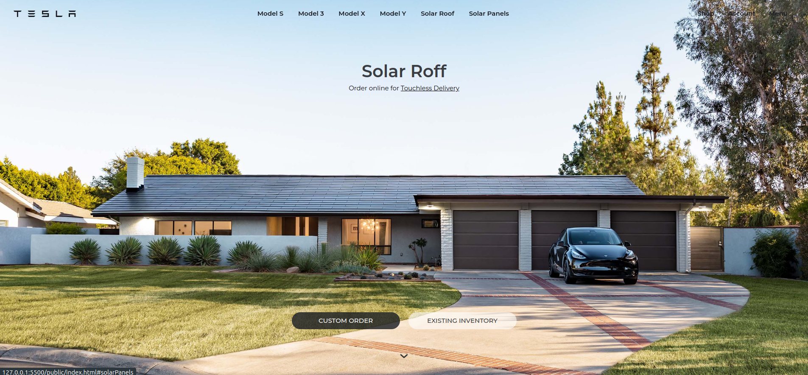

# Project Screenshots

- [Details](https://github.com/puspjoshi) - Project was build for enhance the github portfolio. 

> 
> 
> 
> 
> 

## Learning

- ["Art of Readme - Learn the art of writing quality READMEs."](https://github.com/hackergrrl/art-of-readme#readme) - *Stephen Whitmore*
- ["Elegant READMEs"](https://www.yegor256.com/2019/04/23/elegant-readme.html) - *Yegor Bugayenko*
- ["How To Write A Great README"](https://thoughtbot.com/blog/how-to-write-a-great-readme) - *Caleb Thompson (thoughtbot)*
- ["Readme Driven Development"](https://tom.preston-werner.com/2010/08/23/readme-driven-development.html) - *Tom Preston-Werner*
- ["Top ten reasons why I won’t use your open source project"](https://changelog.com/posts/top-ten-reasons-why-i-wont-use-your-open-source-project) - *Adam Stacoviak*
- ["What I learned from an old GitHub project that won 3,000 Stars in a Week"](https://www.freecodecamp.org/news/what-i-learned-from-an-old-github-project-that-won-3-000-stars-in-a-week-628349a5ee14/) - *KyuWoo Choi*
- *Architecture*
    - ["ARCHITECTURE.md"](https://matklad.github.io/2021/02/06/ARCHITECTURE.md.html) - *Alex Kladov*
    - ["Two open source projects with great documentation"](https://johnjago.com/great-docs/) - *John Jago*

## Presentations

- ["Build a Better README"](https://www.youtube.com/watch?v=vfZuFo1gTB8&list=PLA9_Hq3zhoFw6patag2gZcDjpugDLBStL&index=31) - *Jason A. Crome* at *The Perl and Raku Conference* in 2024 in Las Vegas, Nevada, USA.

## Creating GIFs

Embedding an animated gif in your README quickly demonstrates what your project does and catches the reader's eye. Here are a few programs that can help you quickly create gifs for your project:

- [Gifski](https://github.com/sindresorhus/Gifski#readme) - **FREE** - More vivid colors than the rest, but still keeps size low.
- [Giphy Capture](https://giphy.com/apps/giphycapture) - **FREE** - Easy to upload to giphy.com, with a slightly annoying UX.
- [LICEcap](https://www.cockos.com/licecap/) - **FREE** - Less intuitive, but with more features.
- [Peek](https://github.com/phw/peek#readme) - **FREE** - Simple and easy to use for Linux users.
- [ScreenToGif](https://github.com/NickeManarin/ScreenToGif/) - **FREE** - Open source, with a customizable UI and easily editable GIFs, easy to get started.
- [terminalizer](https://github.com/faressoft/terminalizer) - **FREE** - Record your terminal and generate animated GIF images or share a web player.
- [ttystudio](https://github.com/chjj/ttystudio#readme) - **FREE** - For command-line tools, a terminal-to-GIF recorder minus the headaches.
- [vhs](https://github.com/charmbracelet/vhs) - **FREE** - Generate beautiful terminal GIFs with a simple scripting language

## Get Feedback

- [feedmereadmes](https://github.com/LappleApple/feedmereadmes#readme) - Free README editing+feedback to make your open-source projects grow. See the README maturity model to help you keep going.
- [maintainer.io](https://maintainer.io/) - Free README standardization and feedback, if you click on 'Book an audit'.

## Contribute

Contributions are always welcome!
Please read the [contribution guidelines](contributing.md) first.

## License

To the extent possible under law, [Matias Singers](https://mts.io) has waived all copyright and related or neighboring rights to this work.
